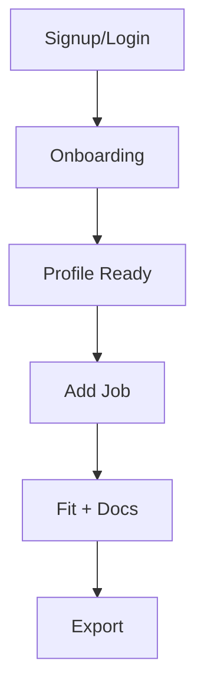
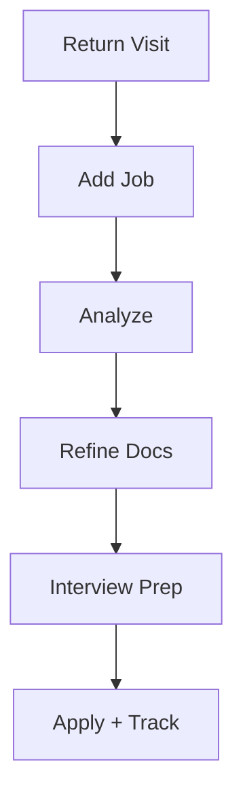

# 05. Core Flow Diagrams

## Flow 1: Signup to First Value
1. User signs up/logs in.
2. User is routed to onboarding.
3. User completes baseline profile.
4. User adds first job.
5. System returns fit + generated docs.
6. User exports and marks as application-ready.

## Flow 2: Repeat Weekly Usage
1. Return to dashboard.
2. Add/import job.
3. Review fit and evidence match.
4. Regenerate docs if needed.
5. Export + interview prep.
6. Track status in applications/ready queue.

## Flow 3: Upgrade trigger (future)
1. User hits free limit / premium feature wall.
2. Sees value recap (time saved + output quality).
3. Upgrades and unlocks higher usage/features.

## Mermaid sketches

## Missing
- Exception paths: failures, incomplete profile, weak evidence.
- Cancel/downgrade flow diagram.
